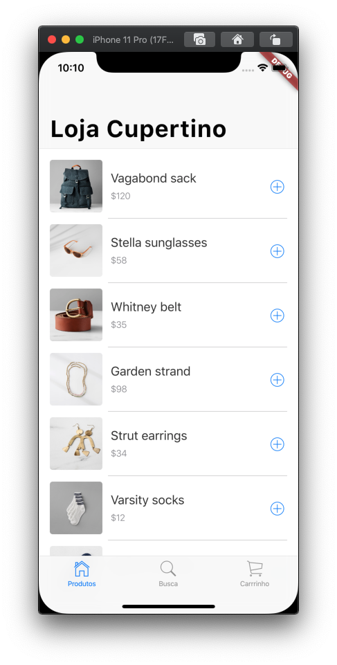
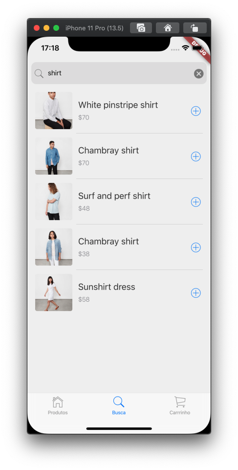

# Construindo um aplicativo Cupertino com Flutter

Este projeto contém o código fonte codelab [Building a Cupertino app with Flutter](https://codelabs.developers.google.com/codelabs/flutter-cupertino) que foi traduzido por mim e disponibilizado em [Construindo um aplicativo Cupertino com Flutter](https://ivanwhm.gitbook.io/laboratorios-de-codigo-do-flutter/construindo-um-aplicativo-cupertino-com-flutter/introducao).

Todo o código foi adaptado para que você possa ter a melhor experiência em aprender Flutter sem a barreira do idioma Inglês.

Acompanhe todos os laboratórios de código Flutter traduzidos no endereço [https://ivanwhm.gitbook.io/laboratorios-de-codigo-do-flutter/](https://ivanwhm.gitbook.io/laboratorios-de-codigo-do-flutter/)

Aba Produtos | Aba Busca | Aba Carrinho
---|---|---
 |  | 

Feito com &hearts; por Ivan Wilhelm.

Codificado no [Visual Studio Code](https://code.visualstudio.com) da [Microsoft](https://www.microsoft.com.br)